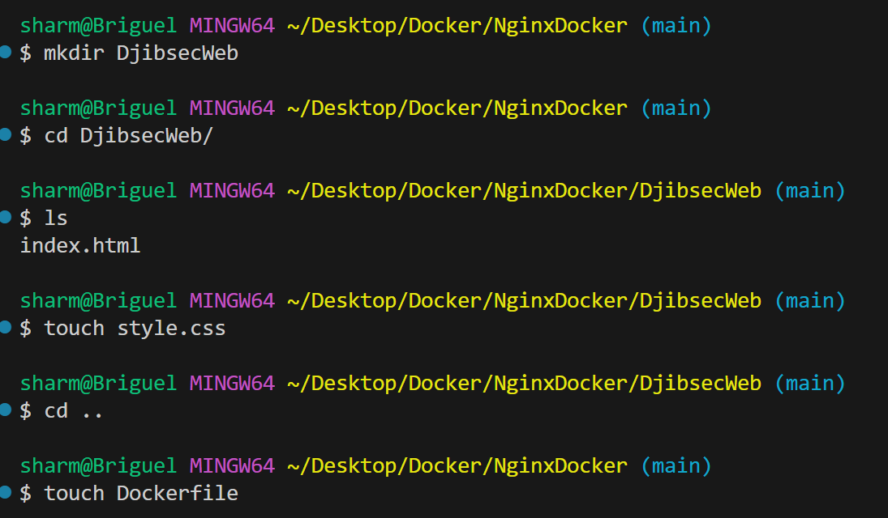
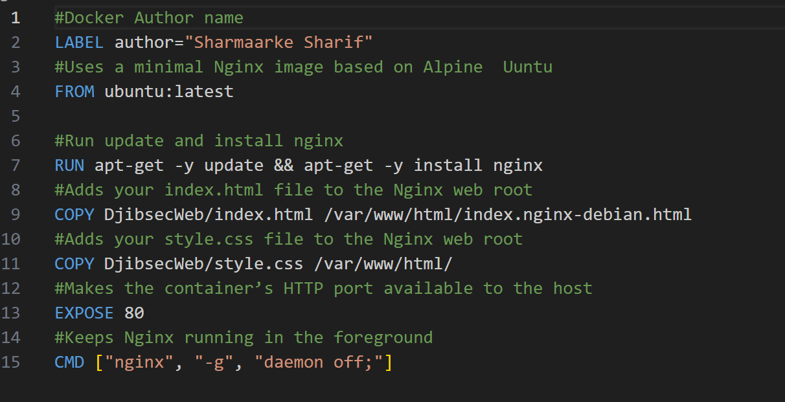
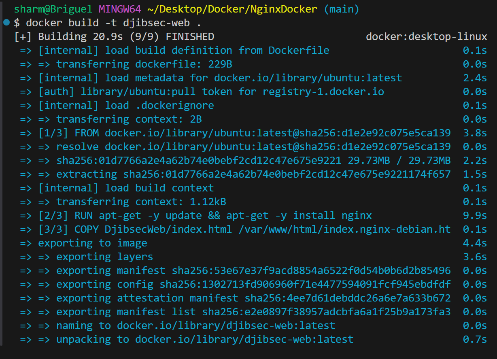
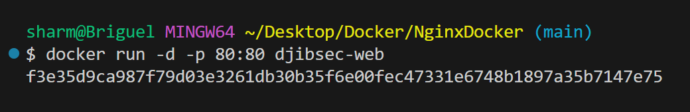
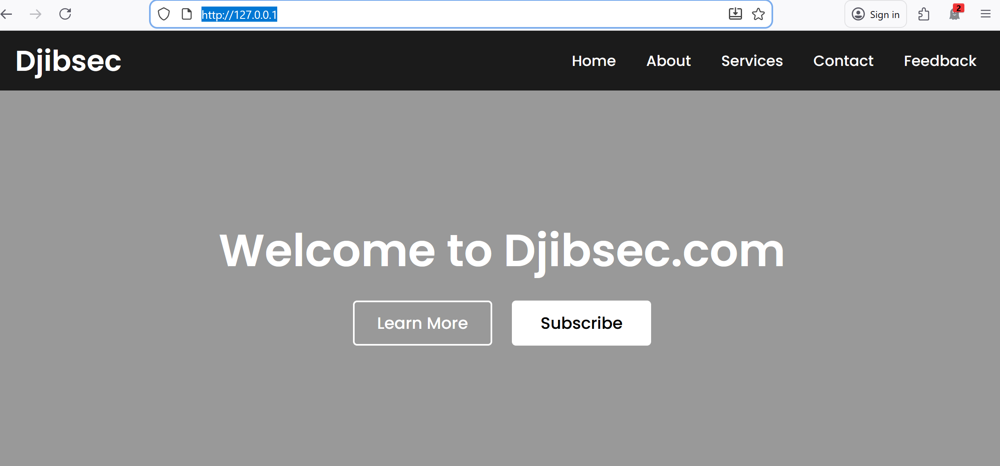

# Deploying a  Website with Docker and Nginx  
In this step, I am creating a custom page for your website. This setup allows you to have persistent website content that’s hosted outside the container 

->Create a new directory for your website content within the home directory: 
->Create an HTML file to serve on your server 
->Create an CSS file to serve on your server 
->Create a Dockerfile 

# Step 1: Create Project Structure

<b> NginxDocker/ </b>
     ->DjibsecWeb
         index.html
         style.css
     -> Dockerfile
      

# Step 2: Create the Dockerfile

Here’s the Dockerfile  and what this does:

#Docker Author name  
<b> LABEL author="Sharmaarke Sharif" </b>

#Uses a minimal Nginx image based on Alpine  Ubuntu  
<b> FROM ubuntu:latest </b>

#Run update and install nginx  
<b> RUN apt-get -y update && apt-get -y install nginx </b>

#Adds your index.html file to the Nginx web root  
<b> COPY DjibsecWeb/index.html /var/www/html/index.nginx-debian.html </b>

#Adds your style.css file to the Nginx web root  
<b> COPY DjibsecWeb/style.css /var/www/html/ </b>

#Makes the container’s HTTP port available to the host  
<b> EXPOSE 80 </b>

#Keeps Nginx running in the foreground  
<b> CMD ["nginx", "-g", "daemon off;"] </b>

# Step 3: Build the Docker Image

<b>docker build -t djibsec-web </b>

# Step 4: Run the Container
To start your Nginx Docker container, run this command:  
<b>docker run -d -p 80:80 djibsec.com  </b>
 

# Step 5: Visit http://localhost:80 
In a web browser, enter your server IP address to reveal Nginx’s default landing page.  
In my  case , I enter http://localhost   

 

# Additional docker commands usefull:  
By running the docker ps command, you’ll encounter some new information about your container: 
<b> docker ps </b>

List all the containers and their status  
<b> docker ps -a </b>

Stop the container by running the following command: 
<b> docker stop  container-name </b>

Remove a container with this command:
<b> docker rm container-name  </b>

# Conclusion: 
You now have a running Nginx container serving a custom web page and have learned how to configure Nginx from within your container.
